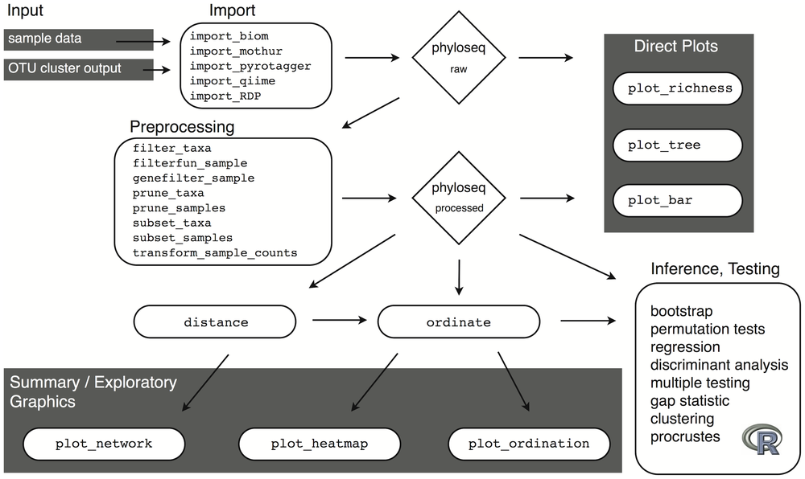
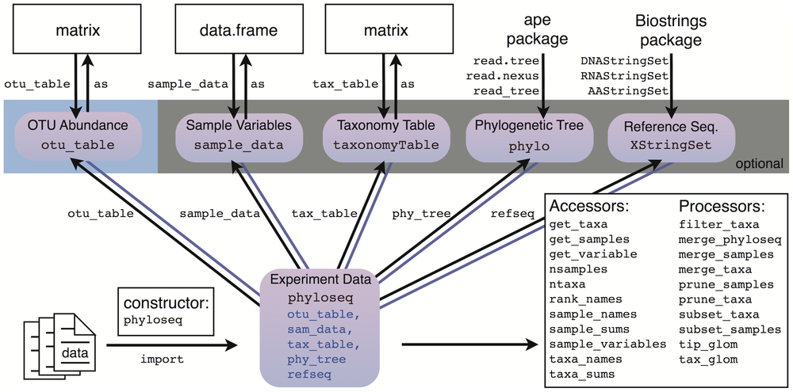

# phyloseq-cheatsheet

Minimal cheatsheet for functions in the phyloseq R package.

**Contents**

- [Workflow](#workflow)
- [Class accessors](#class-accessors)
- [Code snippets](#code-snippets)
- [Insights](#insights)
- [Useful Resources](#useful-resources)


## Workflow



> Attribution: McMurdie, Holmes (2013)
> https://doi.org/10.1371/journal.pone.0061217.g002


## Class accessors



> Attribution: McMurdie, Holmes (2013)
> https://doi.org/10.1371/journal.pone.0061217.g003


## Code snippets

Cheatsheet has four columns:
1. **Type** = Input, Data, Wrangle, Plot
2. **Function** = Function as called in script
3. **Description** = Terse description of function
4. **Example** = Minimal code example to demonstrate function; will often make
   use of built-in data from `phyloseq`

| Type    | Function         | Description          | Example                |
|---------|------------------|----------------------|------------------------|
| Data    | `enterotype`     |                      | `data(enterotype)`     |
| Data    | `GlobalPatterns` |                      | `data(GlobalPatterns)` |
| Data    | `esophagus`      | Subset of esophageal | `data(esophagus)`      |
| Wrangle | `psmelt`         | Change to data frame | `psmelt(esophagus)`    |


## Insights

### `prune_*` versus `subset_*`

There is a subtle difference between the `prune_*` and `subset_*` functions.

The `prune_` functions (e.g., `prune_samples()`) keep the set of observations based
on the data in the phyloseq object itself, such as conditioning on one of the
columns.

The `subset_` functions (e.g., `subset_samples()`) keep the set of observations based
auxillary data and/or evaluated expressions. In other words, it is a wrapper function
around the base R `subset()` function.

Here are some examples:

```r
# Source: https://joey711.github.io/phyloseq/preprocess.html
GP.chl <- subset_taxa(GlobalPatterns, Phylum == "Chlamydiae")
GP.chl <- prune_samples(sample_sums(GP.chl) >= 20, GP.chl)
```

The `subset_taxa()` function uses the already present `Phylum` column in the taxonomy
table to subset the data. Meanwhile, the `prune_samples()` function uses an expression
that evaluates to `TRUE/FALSE` in order to subset the samples. This sort of expression
could not be evaluated using the `subset_samples()` function.


### Extracting data frames into tibbles

When extracting data frames from `phyloseq` using accessors like `sample_data()` can
end up with unintended consequences, as noted here.

In this example, the code shows various ways to access the sample data and converting
it to a non-`phyloseq` data frame and looking at the dimensions of the object.

Notice the cases when the dimensions go from 26 x 7 to 8 x 8.

``` r
library(phyloseq)
library(magrittr)
library(tibble)

data("GlobalPatterns")

# Natural use but with phyloseq object
GlobalPatterns %>%
    sample_data %>%
    dim()
#> [1] 26  7

# Using base R
GlobalPatterns %>%
    sample_data %>%
    data.frame() %>%
    dim()
#> [1] 26  7

# Using base R "as" convention
GlobalPatterns %>%
    sample_data %>%
    as.data.frame() %>%
    dim()
#> [1] 26  7

# Use tibble convention
GlobalPatterns %>%
    sample_data() %>%
    as_tibble() %>%
    dim()
#> Warning in class(x) <- c(subclass, tibble_class): Setting class(x) to
#> multiple strings ("tbl_df", "tbl", ...); result will no longer be an S4
#> object
#> [1] 26  7

# Use tibble function to keep row names
GlobalPatterns %>%
    sample_data() %>%
    rownames_to_column() %>%
    dim()
#> [1] 8 8

# Using base R and row names to column
GlobalPatterns %>%
    sample_data %>%
    data.frame() %>%
    rownames_to_column() %>%
    dim()
#> [1] 26  8

# Using base R "as" convention and row names to column
GlobalPatterns %>%
    sample_data %>%
    as.data.frame() %>%
    rownames_to_column() %>%
    dim()
#> [1] 8 8

# Use tibble convention and row names to column
GlobalPatterns %>%
    sample_data() %>%
    as_tibble() %>%
    rownames_to_column() %>%
    dim()
#> Warning in class(x) <- c(subclass, tibble_class): Setting class(x) to
#> multiple strings ("tbl_df", "tbl", ...); result will no longer be an S4
#> object
#> [1] 26  8
```

<sup>Created on 2019-06-17 by the [reprex package](https://reprex.tidyverse.org) (v0.2.1)</sup>


### `prune_*` vs `subset_*` functions

The `prune_*` functions are when the complete samples or OTUs in the object is available.
Meanwhile, `subset_*` functions use some external information to process the samples.

See https://joey711.github.io/phyloseq/preprocess.html#preprocessing.


## Useful Resources

- [`phyloseq` Official Website](https://joey711.github.io/phyloseq/index.html)
- [DIY: Public Restroom Bacteria](http://joey711.github.io/phyloseq-demo/Restroom-Biogeography)


## License

[](https://creativecommons.org/publicdomain/zero/1.0/)

